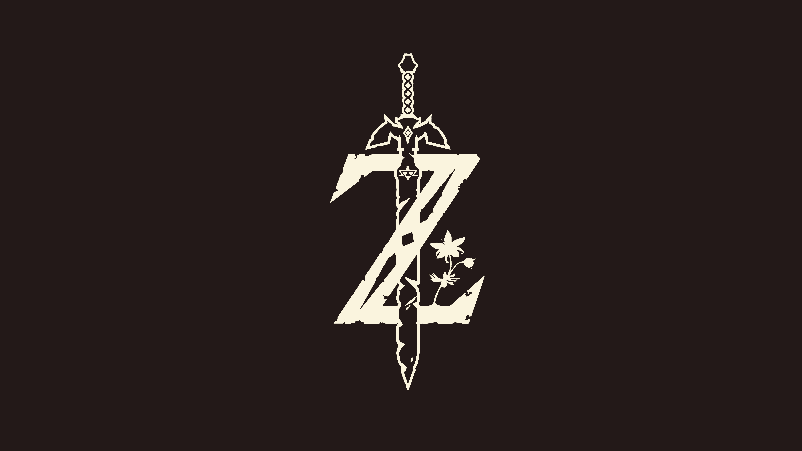

# .files


These are my configuration files for my Linux setup.
The configuration files will work on any distribution; however, there is a bootstrap file that only works on `VOID LINUX GLIB`.
The bootstrap file installs a suite of programs and does not give any prompts to choose otherwise as it is mainly for personal use.
If you wish to utilize the ~bootstrap~ cooking file, the commands are quite simple to change.
Make sure you listen to [this](https://youtu.be/ZD71JeX4Vk0) while installing.

## .my-recipe
* **distro:** Void Linux *glibc*
* **wm:** i3-gaps
* **terminal:** st + zsh
* **font:** tewi2a
* **editor:** vim & atom
* **color-scheme:** Nord
* **notifications:** dunst
* **web:** firefox *alt: qutebrowser/chromium*
* **launcher:** dmenu

## .installer
The chef uses the following ingredients:
```
i3-gaps, dmenu, polybar, htop
firefox, ffmpeg
git, automake, autoconf, make, unzip
feh, compton
R, vim

sauces:
st
tewi-font, google-fonts-ttf, freefont-ttf
```
To-do:
* Ranger, with w3m image previewer (to-do)
* bspwm if I like it.
* Maybe add old Rofi configs
* Add arc-theme; don't really GTK that much doe
* Randomize wallpaper; prob not
* Add texlive, atom, dmenu custom build, st custom build w/ Nord colors 

## .references
I've included the places that I received my content from to give credit and aid if you want to potentially change something using documentation.  
* ST build provided by [Luke Smith](https://github.com/LukeSmithXYZ/st).
* [Nord](https://github.com/arcticicestudio/nord) for colors.
* Current wallpaper is created by [Max028](http://fav.me/db5byph) on deviantArt.
